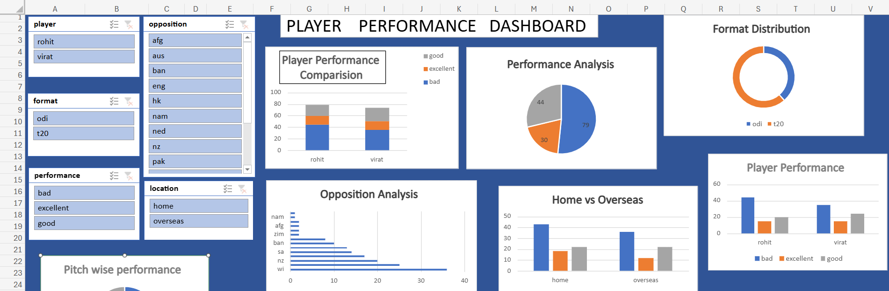
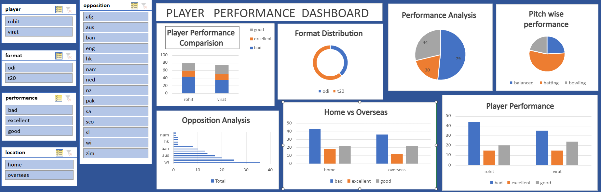
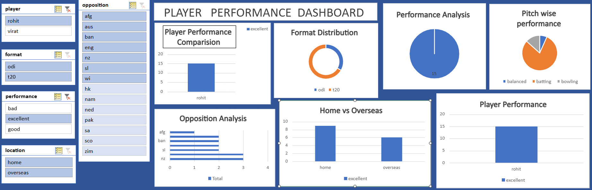
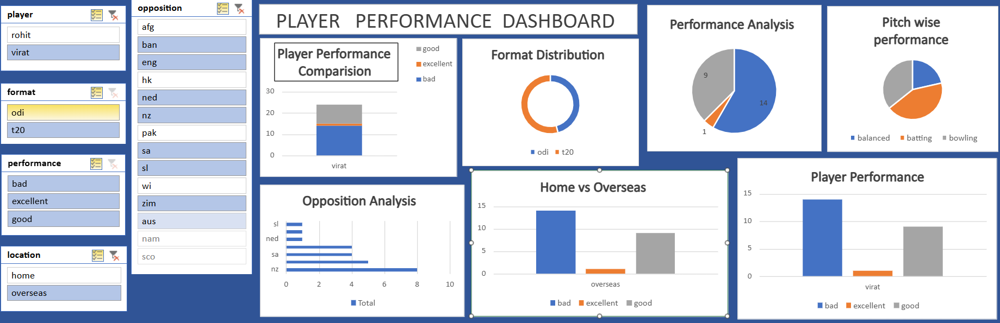

# Cricket-player-performance-dashboard---excel
Interactive excel dashboard comparing Rohit Sharma and Virat Kohli across different formats using pivot tables , charts and slicers
# Cricket Player Performance Dashboard

## Overview
An interactive Excel dashboard designed to analyze and compare the performance of Rohit Sharma and Virat Kohli across different cricket formats. The dashboard provides dynamic insights using Pivot Tables, Pivot Charts, and Slicers.

## Features
- Player Performance Comparison
- Format-wise Distribution Analysis
- Home vs Overseas Performance Analysis
- Opposition-wise Analysis
- Pitch-wise Performance Analysis
- Performance Category Analysis (Excellent, Good, Bad)
- Interactive Filtering using Slicers

## Tools Used
- Microsoft Excel
- Pivot Tables
- Pivot Charts
- Slicers
- Data Visualization Techniques

## Dashboard Screenshots

### Dashboard Overview

### Performance Comparison Dashboard

### Interactive Analysis View

### Filtered Performance View

## Skills Demonstrated
- Data Analysis
- Data Visualization
- Dashboard Development
- Excel Reporting
- Interactive Dashboard Design
- Analytical Thinking

## Project Outcome
Built a dynamic and interactive cricket analytics dashboard that enables users to compare player performance across formats, locations, opposition teams, and pitch conditions through visual insights and interactive filtering.
